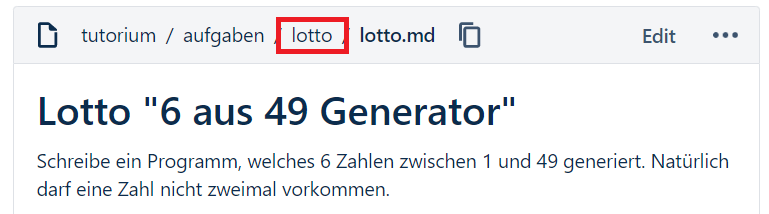

## Ablageort der Musterlösungen

Falls ihr bspw. die [Lotto-Aufgabe](../../aufgaben/lotto/lotto.md) bearbeitet, so findet ihr die Lösungen stets im entsprechenden Elternordner:

```
|-- lotto   # Elternordner   
     |-- README.md   # Aufgabe im md-Format
     |-- L1.py   # erste Musterlösung
     |-- L2.py   # eventuelle zweite Musterlösung
```

--> Im Repo einfach auf `lotto` klicken:


[Zurück](hinweise.md)